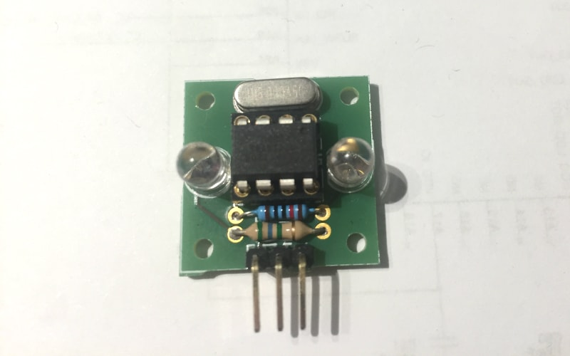

### LEDAR


The LEDAR is a 23x23mm open-source, stand-alone, programmable reflectometer/proximity smart sensor based on ATtiny85. It is engineered to be easily configurable, have a range of 6 meters in ideal conditions and to be easily crafted at home with common DIP components. To make this device accessible to many at a really low cost, the photodiode chosen for detection is the same used for emission, a simple visible light, infrared or ultraviolet LED. It needs only 3 pins (PJON, 5v, GND) to operate transmitting samples and receiving incoming configuration on the same PJON IO pin.

```cpp  
 _______   _______   _______
|       | |       | |       |   ___/\/\/\___ GND
| LEDAR | | LEDAR | | LEDAR |  |   1-5 MΩ
|_______| |_______| |_______|  |  
____|||_______|||_______|||____|_ SoftwareBitBang bus
_____||________||________||______ +5v
______|_________|_________|______ GND
```
Many LEDARs can be connected to the same [SoftwareBitBang](/src/strategies/SoftwareBitBang/README.md) bus. Each LEDAR is running an instance of the PJON protocol stack with its own configurable device id, so many can coexist on the same medium.

Its detection method is based on two interesting characteristics of LEDs:
- If hit by light, LEDs produce a tiny amount of electricity, thanks to the photo-electric effect
- LEDs used as detectors are generally more sensitive to the frequency they emit if used as emitters, making a couple of identical LEDs generally used for lighting, in two extremely efficient wireless transceivers that can be used for reflectometry or also for wireless communication using the [AnalogSampling](/src/strategies/AnalogSampling/README.md) strategy

Its sampling method is based on two different samples:
- Background noise or ambient light sample `B`
- Sampling while emitting light `E`

Reflex intensity or `R` is estimated simply subtracting the background noise sample to the active one `(R = E - B)`.

The internal 1.1v analog reference and analog readings integration are used to higher reflex detection resolution.

#### Configuration
A standard program is proposed to let users easily configure LEDARs using only a series of commands on its PJON [SoftwareBitBang](/src/strategies/SoftwareBitBang/README.md) bus, and automatically save its result in the EPROM to avoid the tedious need of flashing the chip multiple times. LEDAR accepts incoming configuration if sent by `MASTER_ID` and its configured recipient id.

| Command                         | Parameter     | Effect                        |
| --------------------------------| --------------| ------------------------------|
|  `C` Header configuration       | `uint8_t`     | Sets header configuration     |
|  `D` Detection threshold        | `uint16_t`    | Sets detection threshold      |
|  `E` Reading request            | none          | Requests a new reading        |
|  `I` Id configuration           | `uint8_t`     | Sets device id                |
|  `L` Reading iterations         | `uint16_t`    | Sets new iterations count     |
|  `M` Mode configuration         | `uint8_t`     | Sets operation mode           |
|  `Q` Configuration block        | none          | Blocks incoming configuration |
|  `R` Recipient id configuration | `uint8_t`     | Sets recipient id             |
|  `T` Transmission interval      | `uint16_t`    | Sets transmission interval    |
|  `X` Configuration reset        | none          | Sets configuration to default |

- `M` Detection mode can be set to `0` (passive mode), where only presence detection is transmitted if threshold is reached or `1` (active mode) where the sensor cyclically transmits data depending on transmission interval configuration or `T`
- `D` Threshold can be set when in passive mode or `M0` to activate a sending only if a certain value is reached
- `L` Reading iteration count affects reading resolution and duration, setting a higher amount of readings will higher reading duration as well as resolution. Consider that for now LEDAR supports an output of up to 65535, transmitting data in a 2 bytes fixed format. Dynamic data length related to data magnitude will be added in the next software versions
- `Q` For security reasons it is possible to block incoming configuration, although further configuration is possible flashing the [LEDAR](software/LEDAR/LEDAR.ino) sketch on the ATtiny85 using an ISP programmer.

Using the proposed [Console](software/Console/Console.ino) example and an Arduino compatible device it is possible to input configuration with an easy to use console interface.

##### List of materials
- 1x breadboard or proto-board or PCB    
- 1x 4 pin DIP socket                    
- 1x ATtiny85                            
- 1x 16MHz crystal oscillator            
- 1x Photodiode / LED (also normal LED emitters can be used as photodetectors)   
- 1x Resistor to set correct emitter LED's supply voltage                     
- 1x LED chosen to match photodiode's peak spectrum sensitivity          
- 1x 1-10MΩ resistor used to pull down detector's output                 
- 1x 3 pin 2.54mm interface                                              

#### Circuit
The circuit is quite simple and can be tested quickly on a breadboard. It is composed by 6 elements, the MCU, its clock, a couple of resistors and a couple of LEDs. This particular LEDAR was built with NOS (new old stock) components and infrared LEDs. The emitter LED is connected to PB0 through a current limiting resistor selected depending on its forward voltage, the other LED used as a detector, is connected to PB2 using ADC1 with a pull-down resistor connected to ground with a value of 1-10MΩ related to the amount of current produced by the detector. XTAL1 and 2 pins are connected to the crystal oscillator and PB1 is used for communication and configuration. Take a look at the [Fritzing project](hardware/fritzing/LEDARv5.fzz) if you need more details.



This is its dedicated printed circuit board produced by the [Fritzing FAB](https://go.aisler.net/fritzing) and a 3d printed case, used to higher sensitivity and avoid direct line of sight between the emitter and the sensor.


The mounting holes distance is 37mm center to center, as well as Sharp sensors like GP2D12, to be compatible with many mounts already available on the market.


The case is made by two elements and it has been printed using a customized Prusa i3 with a 0.2mm diameter nozzle with a print speed of 45mm/s  and travel speed 120mm/s (I hate to wait) using black, eco-sustainable, corn derived PLA. The whole sensor weights around 6.5 grams.

Once crafted, ATtiny85 has to be flashed with the [LEDAR](software/LEDAR/LEDAR.ino) sketch using an ISP programmer, see [ATtiny85 interfacing](https://github.com/gioblu/PJON/wiki/ATtiny-interfacing)

LEDAR has been engineered with the strong feeling that, in the future, "smart houses" will not necessarily host a multitude of inefficient and convoluted embedded real-time operative systems, in whatever "thing", consuming a lot of power running Ethernet over WiFi and exposing vulnerabilities also out of the physical boundaries of houses. Otherwise, more probably, will host many dedicated microcontrollers connected to a wired, common, open-source, lightweight and less power consuming communication bus, unhackable without direct physical access to its wiring.

LEDAR should be considered as a general "guideline" on how PJON compatible devices can be published and shared with other PJON users through the [devices](../../README.md) directory. Feel free to make a pull request proposing a new device you have engineered.   
