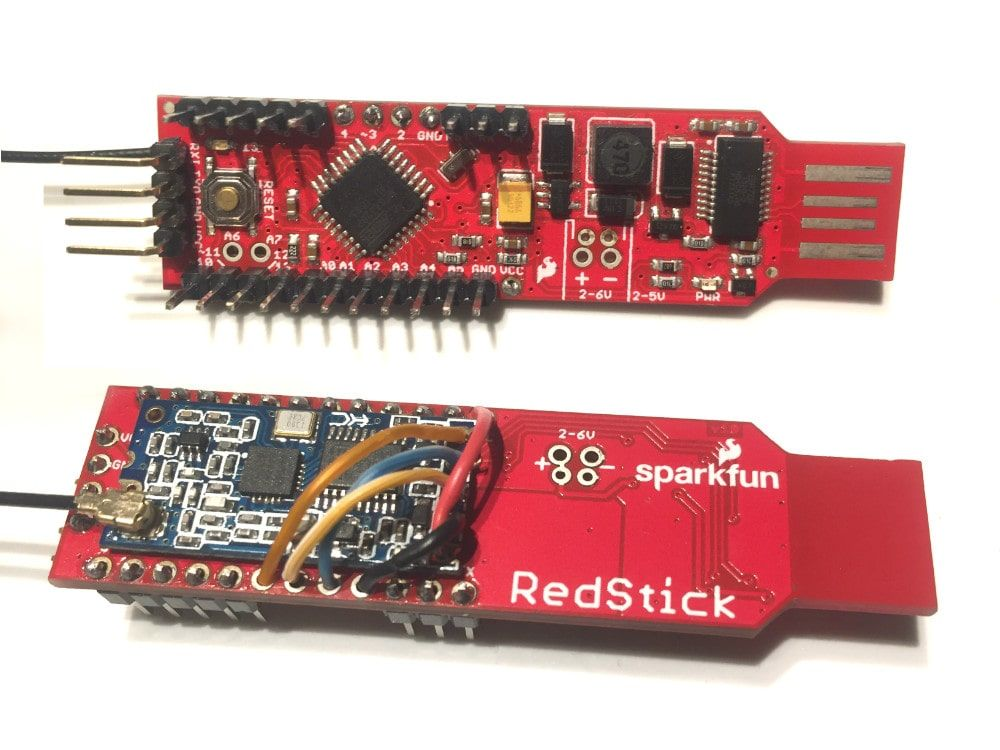

## LocalChat example
LocalChat is a wireless instant messaging application example implemented in 170 lines of code. It uses a laptop or a desktop computer and the Arduino IDE serial monitor for the user interface. Connectivity is provided by an Arduino compatible device wired to a HC-12 wireless serial module. PJON in local mode is used to support connectivity for up to 254 unique users or 127 one-to-one conversations. LocalChat is a proof of concept demonstrating how, using PJON and open-hardware, decentralized networking can be easily achieved with interesting implications.

```cpp  
/* User's 1 laptop                                        User's 2 laptop
  __________________                                     __________________
 ||1:Ciao 2!       ||                                   ||1:Ciao 2!       ||
 ||2:Ciao 1 :)     ||     LOS or line of sight range    ||2:Ciao 1 :)     ||
 ||1:Cool chat!    ||             150-1800m             ||1:Cool chat!    ||
 ||________________||          |             |          ||________________||
 |__________________| USB  ____|__         __|____  USB |__________________|
 |[][][][][][][][][]|=====|ARDUINO|       |ARDUINO|=====|[][][][][][][][][]|
 |[][][][][][][][][]|     | HC-12 |       | HC-12 |     |[][][][][][][][][]|
 |[][][]|____|[][][]|     |_______|       |_______|     |[][][]|____|[][][]|
 |__________________|                                   |__________________|

*/
```

To wirelessly connect the n computers (up to 254) you need only n Arduino compatible devices and n HC-12 modules.

The wiring is extremely simple, connect HC-12 TX pin to Arduino pin 2 and HC-12 RX pin to Arduino pin 3, then, connect +5v and GND pins to power HC-12 module and connect the Arduino compatible device to the computer's USB. The packet radio can be built using one of the USB enabled Arduino compatible devices, this is a Redstick and HC-12 wired together to obtain a USB stick packet radio running PJON and LocalChat:


The maximum range detected is around 150m in urban environment without line of sight using the default configuration and standard antenna. It is probably possible to reach more than 500 meters in open area with line of sight. The highest maximum range can be reached reducing the data rate and using a good antenna.

###LocalChat test
- Flash the [HC-12-LocalChat](HC-12-LocalChat.ino) example on the Arduino
- Open the Arduino IDE serial monitor at 115200 baud
- Set serial monitor 'Newline' ending
- Enter your user id (1-254) in the text field and press 'Send'
- Enter the recipient's user id (1-254) and press 'Send'

After following the steps described above it is possible to directly chat with the other user simply by typing in the serial monitor's text field and pressing enter. Up to 254 users are supported, communication is completely handled by PJON that is configured to avoid packet duplications by using the packet id feature and to report communication errors that are logged in the interface.
