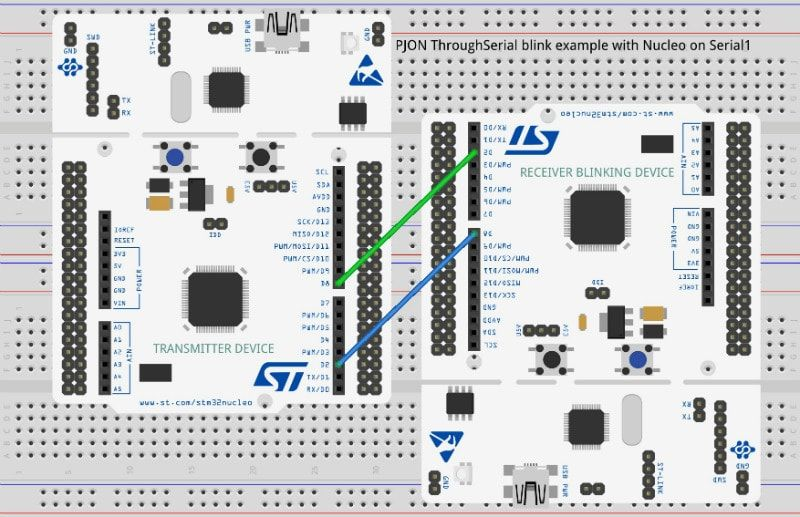

## NucleoBlinkTest example
NucleoBlinkTest demonstrates how to create a point-to-point connection between two STMicroelectronics Nucleo using PJON and [ThroughSerial](https://github.com/gioblu/PJON/tree/master/src/strategies/ThroughSerial). The same procedure can be applied using a Nucleo and any other Arduino compatible device with the same voltage level. Nucleo L053RE sends 10 times per second on `Serial1` (RX pin 2, TX pin 8) "B" to Nucleo F401RE `Serial1` (RX pin 2, TX pin 8). The receiver device is programmed to blink using the built in LED if "B" is received. Here is a video [video demonstration](https://www.youtube.com/watch?v=ztZXRkLhZl8) of this example.

### NucleoBlinkTest example
Connect the 2 devices as shown in the following scheme:

- Connect transmitter `Serial1` TX or pin 8 to receiver device Serial1 RX or pin 2
- Connect transmitter `Serial1` RX or pin 2 to receiver device Serial1 TX or pin 8

### Result
If all goes well the receiver blinks 10 times per second as requested. With an oscilloscope can be observed the bidirectional exchange:

The packet is transmitted and a synchronous acknowledgment is sent by the recipient immediately after reception.
