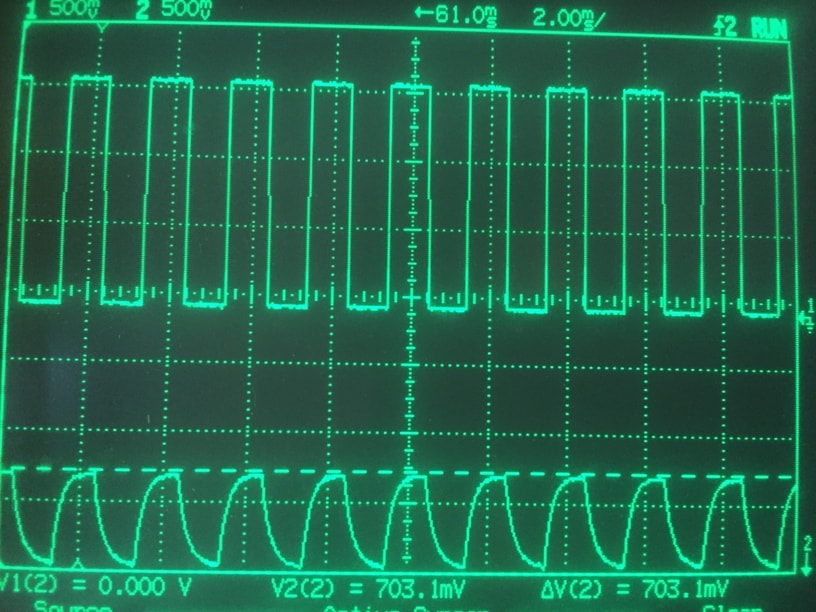
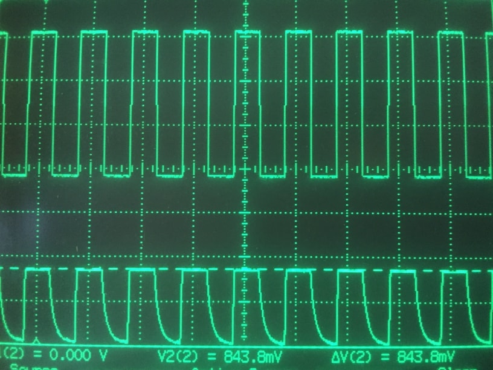
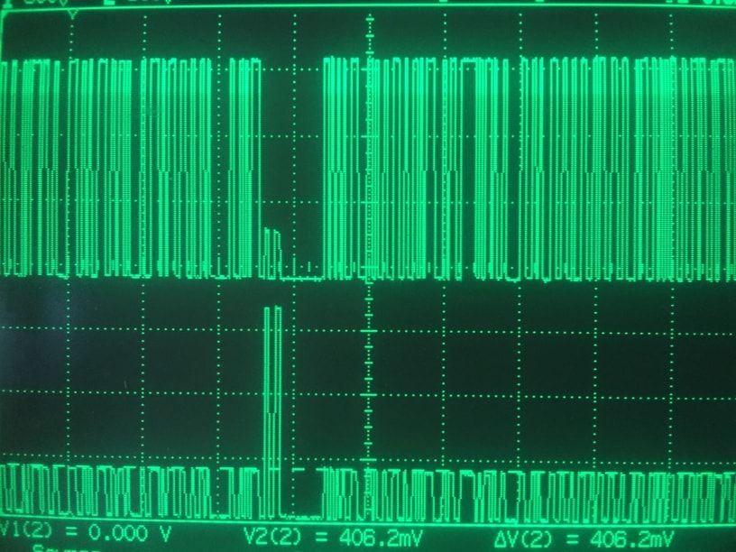

**Medium:** Light |
**Pins used:** 1 / 2

`AnalogSampling` strategy or data link complies with [PJDLS v2.0](/src/strategies/AnalogSampling/specification/PJDLS-specification-v2.0.md), it is designed to communicate data wirelessly using light impulses and its sampling technique is based on analog readings. This strategy is able to use a single LED for both photo-emission and photo-reception phases providing with wireless half-duplex connectivity between devices with a range of up to 5 meters. Most appliances have at least a useless energy consuming LED on board, right?

`AnalogSampling` can also be used with separate emitter and receiver enabling cheap long range wireless LED and laser communication. The proposed circuit, technique and codebase were originally implemented in the far 2011, see the first [video documented experiment](https://www.youtube.com/watch?v=-Ul2j6ixbmE). Take a look at the [video introduction](https://www.youtube.com/watch?v=yIncPe8OPpg) for a brief showcase of its features.

#### Compatibility
- ATmega88/168/328 16MHz (Diecimila, Duemilanove, Uno, Nano, Mini, Lillypad)
- ATmega1280/2560 16MHz (Arduino Mega)

#### Performance
`AnalogSampling` works with the following communication modes:
- `1` runs at 1024Bd or 128B/s
- `2` runs at 1361Bd or 170B/s
- `3` runs at 3773Bb or 471B/s
- `4` runs at 5547Bb or 639B/s
- `5` runs at 12658Bd or 1528B/s

Caution, mode `5` sets ADC clock prescale to a higher rate than manufacturer recommends as maximum ADC sample rate (prescale 16).

#### What can be done?
The most basic example is to connect two devices using a couple of visible light LEDs used as wireless transceivers.


Leveraging of the interesting features of LEDs:
- Emit light if powered by electricity
- Emit a small but detectable amount of electricity if hit by light (photo-electric effect)

It is possible to use LEDs as wireless (bidirectional) transceivers. This means that wireless half-duplex connectivity can be provided by a single LED per device. Not all LEDs behave as good as others so a preliminary evaluation of a set of different products is suggested:

1. Position a couple of identical LEDs on a breadboard aiming at each other
2. Connect one channel of the oscilloscope to the positive lead of one LED
3. Power the connected LED with a 500Hz square wave
4. Connect oscilloscope's remaining channel to the other LED's positive lead
5. Connect all grounds together

If you don't have a square wave generator you can use an Arduino:
```cpp
digitalWrite(12, HIGH);
delay(1);
digitalWrite(12, LOW);
delay(1);
```

Looking at the 2 channels it should be observed:

- The Transmitter's channel showing a crisp 5v signal
- The Receiver's channel showing a lower voltage signal with transitions slopes

Testing different LEDs with the same conditions shows that some produce a higher or lower voltage and transitions that are steeper or slower and more gradual. To obtain the best performance it is required to find a LED with the following characteristics:
- Highest voltage produced when hit by light
- Fastest and steepest transitions between states

The picture below shows the [KCL5587S](https://datasheet.octopart.com/KCL5587S-Kodenshi-datasheet-62058055.pdf) that is evidently not the LED we are looking for.



The [L-53SF4C](https://www.rapidonline.com/pdf/55-9204_v1.pdf) instead is able to run flawlessly at MODE 3 (3773Bb or 471B/s):



It is necessary to add a 75K-5MΩ pull-down resistor connecting the A0 pin with ground to reduce the LED capacitance, bit transition slopes and externally induced interference.

`AnalogSampling` can be used to experiment with short range infrared or visible light communication (i.e. remote control), medium range using light sources (i.e. cars transmitting data through front and backlights) or long range laser communication (i.e. data between ground and LEO).  

The picture below shows a bidirectional exchange where both packet and acknowledgment are clearly visible:



#### How to use AnalogSampling
Pass the `AnalogSampling` type as PJON template parameter to instantiate a PJON object ready to communicate through this Strategy. All the other necessary information is present in the general [Documentation](/documentation).
```cpp  
// Predefine AS_MODE selecting communication mode if needed
#define AS_MODE 1 // 1024Bd  or 128B/s
#define AS_MODE 2 // 1361Bd  or 170B/s
#define AS_MODE 3 // 3773Bb  or 471B/s  (ADC prescale 32)
#define AS_MODE 4 // 5547Bb  or 639B/s  (ADC prescale 16)
#define AS_MODE 5 // 12658Bd or 1528B/s (ADC prescale  8)

/* Acknowledge maximum latency, 15000 microseconds default.
   Could be necessary to higher AS_RESPONSE_TIMEOUT if sending
   long packets because of the CRC computation time needed by
   receiver before transmitting its acknowledge  */
#define AS_RESPONSE_TIMEOUT 15000

/* Set the back-off exponential degree (default 5) */
#define AS_BACK_OFF_DEGREE      5

/* Set the maximum sending attempts (default 10) */
#define AS_MAX_ATTEMPTS        10

/* The values set above are the default producing a 3.2 seconds
   back-off timeout with 20 attempts. Higher SWBB_MAX_ATTEMPTS
   to higher the back-off timeout, higher SWBB_BACK_OFF_DEGREE
   to higher the interval between every attempt. */

#include <PJON.h>

PJON<AnalogSampling> bus;

void setup() {
  // Set the pin A0 as the communication pin
  bus.strategy.set_pin(A0);

  // Set pin A0 as input pin and pin 12 as output pin
  bus.strategy.set_pins(A0, 12);

  // Set threshold (default value AS_THRESHOLD)
  bus.strategy.set_threshold(AS_THRESHOLD);
}
```
After the PJON object is defined with its strategy it is possible to set the communication pin accessing to the strategy present in the PJON instance.

#### Known issues
- Direct sunlight or other light sources can affect receiver's sensitivity and maximum communication range
- Long wires can degrade performance
- Depending on the power supply voltage, LEDs could be overpowered, add a current limiting resistor if required
- Oscilloscope's probe acting as a pull down resistor influences results and the required pull down resistor's value
- A pull-down resistor is required to obtain optimal performance, see above

#### Safety warning
In all cases, when installing or maintaining a PJON network, extreme care must be taken to avoid any danger. When working with an [AnalogSampling](/src/strategies/AnalogSampling) LED or laser based setup safety glasses must be worn and transceivers must be operated cautiously to avoid potential eye injuries. Consider that with [AnalogSampling](/src/strategies/AnalogSampling) all LEDs that are physically connected to an ADC may be used maliciously to both download or upload data wirelessly, effectively circumventing many air-gapping techniques.   
